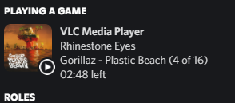

# vlc-rpc
 

Discord rich presence for VLC media player.
This is a fork of [PigPogs](https://github.com/Pigpog/vlc-discord-rpc) VLC RPC, adding automatic album art.

Join us on [Discord](https://discord.gg/CHegxjdFCD).

# Setup

### Requirements

- [Node.JS and NPM](https://nodejs.org/en/) (not needed for bundled releases)
- [VLC](https://www.videolan.org/index.html)
- [Discord desktop client](https://discord.com/)

### Steps

 1. [Download the latest release for your platform](https://github.com/GreenDiscord/vlc-rpc/releases)
 2. Unzip the file
 3. Launch the `start.bat` (on Windows) or `start.sh` (on Linux)
 4. Play media in the VLC window that opens

### Configuration

Configuration is done by editing the `config/config.js` file.
This file is created when first starting vlc-rpc.

Each option is explained in a comment above it.

For advanced features, see [ADVANCED.md](./advanced.md).

## Limitations
 - When running multiple concurrent instances, only the first-opened instance of VLC will have a rich presence
 - This program does NOT allow you to stream media to others

## Known Bugs
 - If you find any bugs, please report them in [Issues](https://github.com/GreenDiscord/vlc-rpc/issues) or the [Discord](https://discord.gg/CHegxjdFCD)

## Nightly Builds
Nightly builds are posted as "Pre-releases" after every commit. These nightly builds may add features, but minimal implementations of them. Using these builds can help us diagnose issues, while giving you more, [Click Here](https://github.com/GreenDiscord/vlc-rpc/releases/tag/nightly) to get the latest nightly builds.
